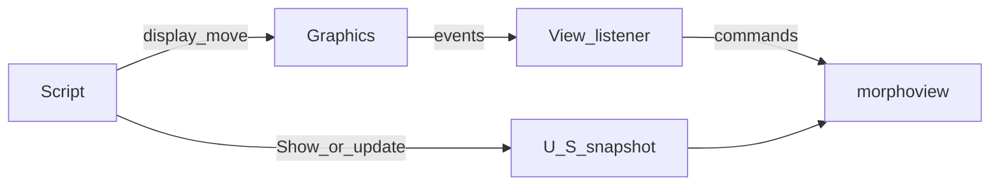

# Plan: Graphics live model + View listener

Design source of truth: [`definedraw.md`](definedraw.md). Viewer transport stays define vs draw; Morpho API is Graphics mutations → listeners → View.

**Working agreement:** one phase at a time; pause for review before starting the next. Start with Phase 1 only when approved.

**Ergonomics constraint:** the Graphics modification API stays small and concrete — especially a single pose verb `move` (not separate scale/rotate/translate). View listener and viewer commands are implementation detail. Target loop:

```
var ball = g.display(unitBall)
v.open(g)
g.begin()
g.move(ball, [x,y,z], scale=ballR, rotate=[angle,0,1,0])
g.move(shadow, [x,0.02,z], scale=shadowR)
g.end()
```



## Non-goals

- General Morpho dependent-object framework (learn from this; formalize later)
- Auto-diff inside `update(Graphics)`
- Full scene graph / Mesh-registry API
- Binary transport; pick events
- `U O` / `U V` in the first cut (follow-on once redraw works)

## Phase 1 — Graphics ids + Show define/draw foundation

**Files:** `share/modules/xgraphics.morpho`, `test/`

1. `Graphics.display(item)` allocates id, stores entry `{ id, item, transform }`, returns id. No `id=` on mesh primitives.
2. `Show` walks **entries**; emit define/draw with entry transforms.
3. Opaque spheres: content fingerprint instancing + uniform `C`; translucent still expands.
4. Keep `replace=true` → full `U S`.
5. Tests: distinct ids from `display`; same primitive displayed twice → two ids; N colored opaque spheres → 1× `o`, N× `d`.

No C viewer changes in this phase.

## Phase 2 — Viewer redraw support

**Files:** `src/command.c` / `command.h`, `src/scene.c` / `scene.h`, `src/display.c`, docs, `morphoview.morpho`

1. Sticky `command_applyctx` across `command_process` batches.
2. Command `D` — clear displaylist only; mark changed.
3. `display_prepareall`: `render_reset` before re-prepare after `D`.
4. Parse: `D` must not require parse-time `has_scene` (ok-before-apply race).
5. Docs + make `test/command/definedraw-redraw` runnable.
6. `View.redraw(commands)` — low-level escape hatch (`D\n` + chunk).

## Phase 3 — Graphics mutation API + View listener

**Files:** `xgraphics.morpho` (`Graphics`), `morphoview.morpho` (`View`)

### Graphics

Id-addressable displaylist with presentation:

- `display(item)` assigns/returns Graphics-owned id; store `{ id, item, transform }`.
- `move(id, …)` updates Graphics state, notifies listeners.
- Events (minimal): `defined`, `moved` (add `removed` / `replaced` when needed).
- `addListener` / `removeListener` — no global dependents framework.
- **Batching:** `begin()` / `end()` coalesce N moves → one viewer chunk per frame.

### View as listener

- `View(g)` / `open(Graphics g)`: register listener; initial define+draw.
- On `defined`: emit define (+ draw if pose known).
- On batched `moved`: `D` + redraw current poses (v1: full draw rebuild; optimize later).
- `update(Graphics)` remains full `U S` (define meaning: replace live content).
- Keep `redraw(ascii)` for tests.

## Phase 4 — Yardstick

Rewrite `examples/amigaball.morpho`: define once on `Graphics`, `View(g)`, physics via `g.move` — no per-frame `update(Graphics)`.

## Phase 5 — Follow-ons

- `U O` / `U V` / `X O`
- Finer draw updates without full `D` every frame
- Formal Morpho dependents framework

## Risks

- **Pose model:** unit mesh at origin + Graphics transform (amigaball pattern); avoid fighting baked vertices.
- **Listener lifetime:** register/unregister on open/close.
- **Snapshot vs live:** define `update(g)` after `View(g)` as full replace.
